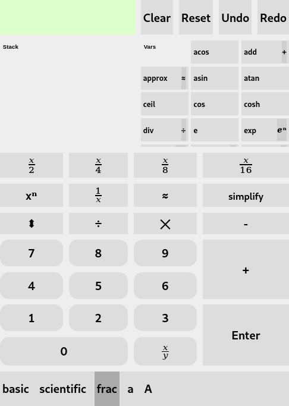

# IRPN: A Mobile-First RPN Calculator written in Idris

- [x] Single-page app
- [x] Uses reverse-polish notation ([RPN](https://en.wikipedia.org/wiki/Reverse_Polish_notation))
- [x] visible stack
- [ ] visible variable environment
- [x] Unlimited undo and redo
- [x] Fraction mode
- [x] Mobile-first, responsive layout.

You can try it [here!](https://emdash.github.io/irpn)

## Overview

### Motivation

This is an idris port of my original pure JavaScript calculator,
available [here](https://github.com/emdash/rpncalc)

I'd been itching to re-write *rpncalc* in a langauge with strong
types. I hope that using Idris will allow me to add advanced features.

The original RPN calculator will remain available, but suffers from a
lack of attention on my part. I pushed the implementation as far as
modern JS would let me, and I let the project languish. I had all
these things I'd wanted to add, but JS wouldn't let me.

### On the Choice of Idris

I started *rpncalc* two years ago, as an exercise in minimalist
web-programming. It was a fun project that was fun to use, and I ended
up *depending* on it. Distributing it as a stand-alone web page meant
I always had access to it, wherever I went, on any device.

I have all these great features I want to add. Bugs I wnat to
fix. Design mistakes I wanted to correct. Unfortunately, having chosen
JavaScript, any kind of gradual refactoring was off the table -- even
with my hand-rolled test suite, it's just too much work. I need types.

So, I decided to re-write *rpncalc* in a strongly-typed
language. There were three criteria:

- It had to be an ML-derived language: I've long wanted to be able to read  Haskell and OCaML source.
- Said language must target JavaScript, as I still want to distribute
  IRPN as stand-alone web page.
- Said language must have dependent types, as I'm excited about their
  benefits, and want to understand them better.

The obvious choices: Haskell, PureScript (and Reason), were ruled out
for lack of true qdependent types. Tl; DR, after having tried the
[alternatives](TBD Wikipedia dependently typed languages),

I eventually found Idris and started making progress. You can [read
about my experience][experience.md]

### caveats

At present, only Firefox is supported, because that is my primary
browser.

## Usage

This section is TBD. For now, refer to the readme from [my previous
project](https://github.com/emdash/rpncalc)

### Roadmap

- [x] get javascript compilation working
- [ ] implement all the functions present in the JS version
- [x] port UX scaffolding and stylesheets from rpncalc
- [x] implement rendering
- [ ] persist sessions via local storage
- [ ] unit-based arithmetic (dimensional analysis)
  - [ ] us customary
  - [ ] SI
  - [ ] CGS
- [ ] drag-and-drop stack stack reordering.
- [ ] tape / history editing.
- [ ] user-defined functions.
- [ ] user-defined units and conversions.
- [ ] improve keyboard operation
- [ ] write a blog post about all this
